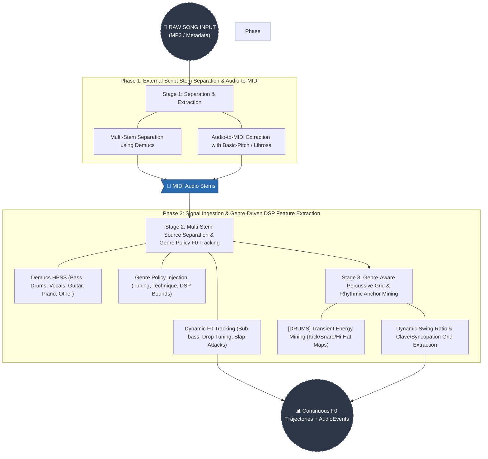

# Pipeline Flow

```mermaid
graph TD
    Input(("🎵 RAW SONG INPUT <br/> (MP3 / Metadata)"))

    %% Phase 1
    subgraph Phase 1: External Script Stem Separation & Audio-to-MIDI
        direction TB
        Stage1["Stage 1: Separation & Extraction"]
        S1A["Multi-Stem Separation using Demucs"]
        S1B["Audio-to-MIDI Extraction with Basic-Pitch / Librosa"]
        
        Stage1 --- S1A
        Stage1 --- S1B
    end

    MIDI_Stems>"🎹 MIDI Audio Stems"]

    %% Phase 2
    subgraph Phase 2: Signal Ingestion & Genre-Driven DSP Feature Extraction
        direction TB
        
        Stage2["Stage 2: Multi-Stem Source Separation & Genre Policy F0 Tracking"]
        S2A["Demucs HPSS (Bass, Drums, Vocals, Guitar, Piano, Other)"]
        S2B["Genre Policy Injection (Tuning, Technique, DSP Bounds)"]
        S2C["Dynamic F0 Tracking (Sub-bass, Drop Tuning, Slap Attacks)"]
        
        Stage2 --- S2A
        Stage2 --- S2B
        Stage2 --- S2C
        
        Stage3["Stage 3: Genre-Aware Percussive Grid & Rhythmic Anchor Mining"]
        S3A["[DRUMS] Transient Energy Mining (Kick/Snare/Hi-Hat Maps)"]
        S3B["Dynamic Swing Ratio & Clave/Syncopation Grid Extraction"]
        
        Stage3 --- S3A
        Stage3 --- S3B
    end

    Output(("📊 Continuous F0 Trajectories + AudioEvents"))

    %% Connections
    Input --> Stage1
    S1A & S1B --> MIDI_Stems
    MIDI_Stems --> Stage2
    Stage2 --> Stage3
    S2C & S3B --> Output
    
    classDef io fill:#2d3748,stroke:#4a5568,stroke-width:2px,color:#fff,stroke-dasharray: 5 5;
    classDef intermediate fill:#2b6cb0,stroke:#2c5282,stroke-width:2px,color:#fff;
    classDef phase fill:#1a202c,stroke:#4a5568,stroke-width:1px,color:#e2e8f0;

    class Input,Output io;
    class MIDI_Stems intermediate;
    style Phase 1 fill:#f7fafc,stroke:#cbd5e0,stroke-width:2px,color:#1a202c;
    style Phase 2 fill:#f7fafc,stroke:#cbd5e0,stroke-width:2px,color:#1a202c;
```